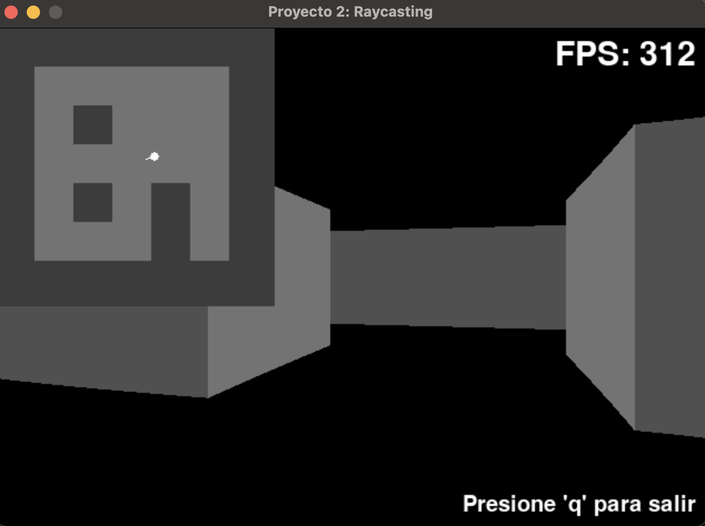

# Proyecto 2: Raycasting
Ray Caster simple usando PyGame que renderiza un nivel entero y jugable

## Objetivos:
Al controlar a su jugador, no se debe poder atravesar a las paredes ni debe crashear.

#### Rúbrica

| Puntos | Descripción                     |
| :-------- | :-------------------------------- |
| `50 pts`      | Juego implementado en RaspberryPi |
| `10 pts`      | Estética, juego renderizado en buena calidad |
| `15 pts`      | +25 fps en RaspberryPi y alrededor de +250 fps en MacBook Air M1|
| `20 pts`      | Cámara con movimiento hacia adelante, atrás y rotación|
| `10 pts`      | Minimapa arriba a la izquierda  |
| `5 pts`       | Musica de fondo |
| `5 pts`       | Pantalla de bienvenida |
| `10 pts`      | Selección de niveles en pantalla de bienvenida |

**Total:** 125 pts

# Pantalla de bienvenida

# Nivel 1 del juego

# Nivel 2 del juego

# Video del funcionamiento en la RaspberryPI
<video width="640" height="360" controls>
  <source src="readme-media/video.mp4" type="video/mp4">
  Your browser does not support the video tag.
</video>

[Enlace a mi video](readme-media/video.mp4)
